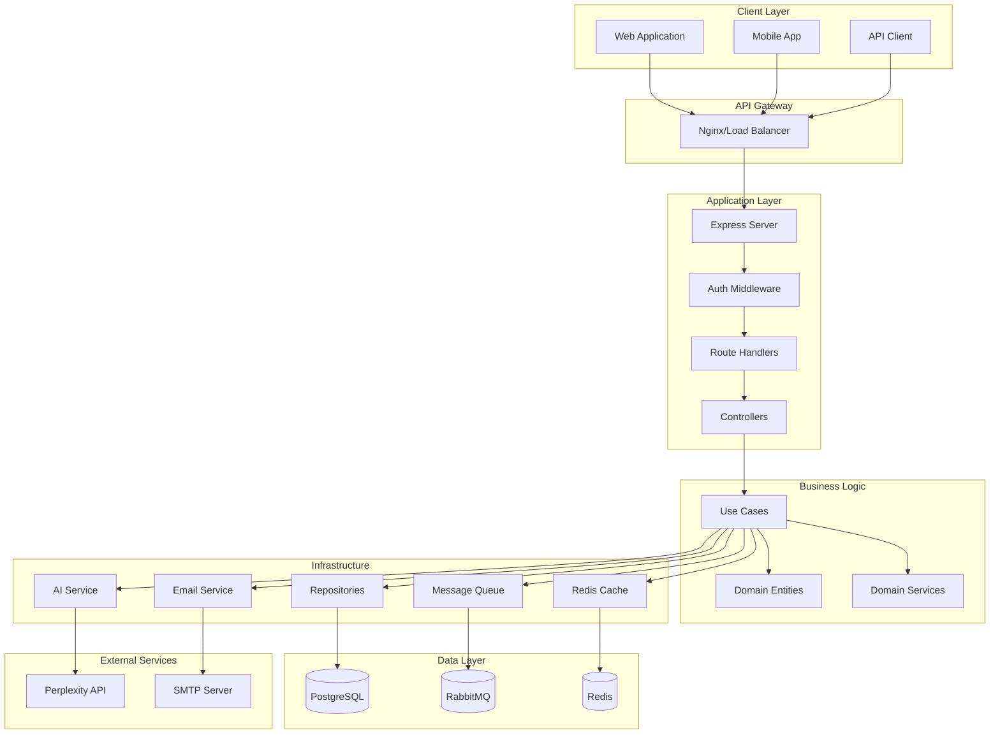
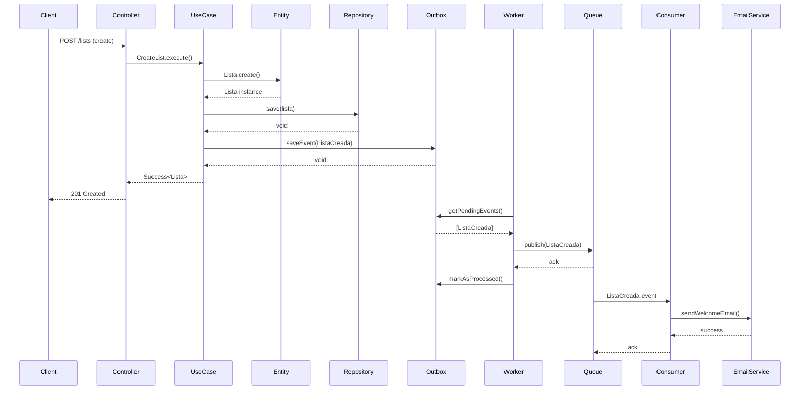
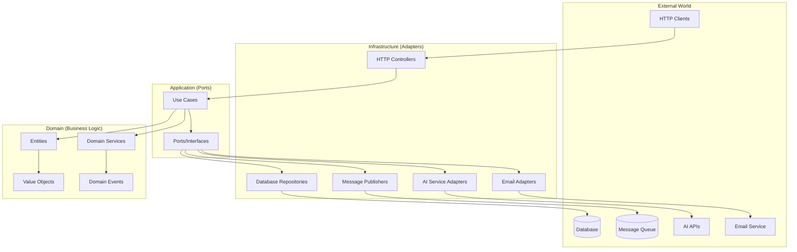

# Arquitectura - Lista de Compra Colaborativa

## Tabla de Contenidos
1. [Visión General](#visión-general)
2. [Principios Arquitectónicos](#principios-arquitectónicos)
3. [Arquitectura Hexagonal](#arquitectura-hexagonal)
4. [Estructura de Capas](#estructura-de-capas)
5. [Patrones Implementados](#patrones-implementados)
6. [Tecnologías y Herramientas](#tecnologías-y-herramientas)
7. [Flujo de Datos](#flujo-de-datos)
8. [Seguridad](#seguridad)
9. [Escalabilidad](#escalabilidad)
10. [Testing](#testing)
11. [Diagramas](#diagramas)

## Visión General

La aplicación de Lista de Compra Colaborativa está diseñada siguiendo los principios de **Arquitectura Limpia (Clean Architecture)** y **Arquitectura Hexagonal (Ports and Adapters)**. El sistema permite a los usuarios crear, gestionar y compartir listas de compra con funcionalidades de colaboración en tiempo real y sugerencias inteligentes mediante IA.

### Características Principales
- 🏗️ **Arquitectura Hexagonal**: Separación clara entre lógica de negocio e infraestructura
- 🔄 **Patrón SAGA/Outbox**: Consistencia eventual y mensajería confiable
- 🤖 **Inteligencia Artificial**: Categorización automática de productos
- 🔐 **Seguridad Robusta**: JWT, bcrypt, rate limiting, validaciones
- 🚀 **Escalabilidad**: Diseño modular y microservicios-ready
- 🧪 **Testing Completo**: Unitarios, integración y E2E

## Principios Arquitectónicos

### 1. Separación de Responsabilidades
- **Dominio**: Lógica de negocio pura, independiente de frameworks
- **Aplicación**: Casos de uso y orquestación
- **Infraestructura**: Adaptadores para bases de datos, APIs externas, HTTP

### 2. Inversión de Dependencias
- El dominio no depende de la infraestructura
- Las dependencias apuntan hacia adentro (hacia el dominio)
- Uso de interfaces (puertos) para abstraer implementaciones

### 3. Principios SOLID
- **S**ingle Responsibility: Cada clase tiene una única responsabilidad
- **O**pen/Closed: Abierto para extensión, cerrado para modificación
- **L**iskov Substitution: Subtitpos sustituibles por sus tipos base
- **I**nterface Segregation: Interfaces específicas y pequeñas
- **D**ependency Inversion: Depender de abstracciones, no de concreciones

### 4. Domain-Driven Design (DDD)
- **Entidades**: Objetos con identidad e invariantes de negocio
- **Value Objects**: Objetos inmutables que representan valores
- **Agregados**: Conjuntos de entidades con consistencia transaccional
- **Domain Services**: Lógica de dominio que no pertenece a una entidad
- **Domain Events**: Eventos de negocio para comunicación asíncrona

## Arquitectura Hexagonal

```
┌─────────────────────────────────────────────────────────────┐
│                        FRAMEWORKS                           │
│  Express/Fastify │ PostgreSQL │ RabbitMQ │ Perplexity API  │
└─────────────────────────────────────────────────────────────┘
                              │
┌─────────────────────────────────────────────────────────────┐
│                    INFRASTRUCTURE                           │
│  ┌─────────────┐ ┌─────────────┐ ┌─────────────┐          │
│  │ HTTP        │ │ Persistence │ │ Messaging   │          │
│  │ Controllers │ │ Repositories│ │ Publishers  │          │
│  │ Routes      │ │ Mappers     │ │ Consumers   │          │
│  └─────────────┘ └─────────────┘ └─────────────┘          │
└─────────────────────────────────────────────────────────────┘
                              │
┌─────────────────────────────────────────────────────────────┐
│                     APPLICATION                             │
│  ┌─────────────┐ ┌─────────────┐ ┌─────────────┐          │
│  │ Use Cases   │ │ DTOs        │ │ Ports       │          │
│  │ Validation  │ │ Mappers     │ │ Interfaces  │          │
│  │ Orchestration│ │            │ │             │          │
│  └─────────────┘ └─────────────┘ └─────────────┘          │
└─────────────────────────────────────────────────────────────┘
                              │
┌─────────────────────────────────────────────────────────────┐
│                       DOMAIN                                │
│  ┌─────────────┐ ┌─────────────┐ ┌─────────────┐          │
│  │ Entities    │ │ Value       │ │ Domain      │          │
│  │ Aggregates  │ │ Objects     │ │ Services    │          │
│  │ Invariants  │ │ Immutable   │ │ Events      │          │
│  └─────────────┘ └─────────────┘ └─────────────┘          │
└─────────────────────────────────────────────────────────────┘
```

## Estructura de Capas

### Domain Layer (src/domain/)
**Responsabilidad**: Lógica de negocio pura y reglas de dominio

```
domain/
├── entities/           # Entidades de negocio
│   ├── Usuario.ts     # Usuario con roles y permisos
│   ├── Lista.ts       # Lista de compra
│   ├── Producto.ts    # Producto con estado y precio
│   ├── Categoria.ts   # Categorización de productos
│   ├── Tienda.ts      # Información de tiendas
│   ├── Invitacion.ts  # Invitaciones para compartir
│   ├── Permiso.ts     # Permisos de colaboración
│   └── Blueprint.ts   # Plantillas de listas
├── value-objects/      # Objetos de valor inmutables
│   ├── Email.ts       # Validación de emails
│   ├── Password.ts    # Validación de contraseñas
│   ├── Hash.ts        # Hashes seguros
│   └── PermissionType.ts # Tipos de permisos
├── services/          # Servicios de dominio
│   └── InvitationHashGenerator.ts # Generación de hashes
├── events/            # Eventos de dominio
│   ├── UsuarioRegistrado.ts
│   ├── ListaCreada.ts
│   ├── ListaCompartida.ts
│   ├── ProductoAnadido.ts
│   └── InvitacionEnviada.ts
└── errors/            # Errores específicos del dominio
    ├── DomainError.ts
    ├── InvalidEmailError.ts
    └── InvalidPasswordError.ts
```

### Application Layer (src/application/)
**Responsabilidad**: Casos de uso y orquestación de la lógica de aplicación

```
application/
├── use-cases/         # Casos de uso por dominio
│   ├── auth/          # Autenticación y autorización
│   │   ├── RegisterUser.ts
│   │   └── AuthenticateUser.ts
│   ├── lists/         # Gestión de listas
│   │   ├── CreateList.ts
│   │   ├── UpdateList.ts
│   │   ├── DeleteList.ts
│   │   ├── GetUserLists.ts
│   │   └── ShareList.ts
│   ├── products/      # Gestión de productos
│   │   ├── AddProduct.ts
│   │   ├── UpdateProduct.ts
│   │   ├── DeleteProduct.ts
│   │   └── MarkProductAsPurchased.ts
│   ├── ai/            # Funcionalidades de IA
│   │   └── GetCategorySuggestions.ts
│   ├── blueprints/    # Plantillas
│   │   ├── CreateBlueprint.ts
│   │   └── CreateListFromBlueprint.ts
│   └── admin/         # Funciones administrativas
│       ├── ImpersonateUser.ts
│       └── EndImpersonation.ts
├── ports/             # Interfaces (puertos)
│   ├── repositories/  # Contratos de persistencia
│   ├── messaging/     # Contratos de mensajería
│   ├── external/      # Contratos de servicios externos
│   └── auth/          # Contratos de autenticación
├── dto/               # Data Transfer Objects
│   ├── auth/
│   ├── lists/
│   ├── products/
│   └── shared/
└── errors/            # Errores de aplicación
    ├── ValidationError.ts
    ├── UnauthorizedError.ts
    └── NotFoundError.ts
```

### Infrastructure Layer (src/infrastructure/)
**Responsabilidad**: Implementaciones concretas y adaptadores

```
infrastructure/
├── persistence/       # Persistencia de datos
│   ├── prisma/        # Configuración Prisma
│   ├── repositories/ # Implementaciones concretas
│   ├── mappers/       # Mapeo dominio ↔ persistencia
│   └── in-memory/     # Implementaciones para testing
├── http/              # Interfaz HTTP
│   ├── controllers/   # Controladores REST
│   ├── routes/        # Definición de rutas
│   ├── middlewares/   # Middlewares personalizados
│   └── server.ts      # Configuración del servidor
├── messaging/         # Mensajería asíncrona
│   ├── rabbitmq/      # Implementación RabbitMQ
│   ├── outbox/        # Patrón Outbox
│   └── consumers/     # Consumidores de eventos
├── external-services/ # Servicios externos
│   ├── ai/            # Integración con Perplexity
│   ├── email/         # Servicio de emails
│   ├── auth/          # JWT y bcrypt
│   └── cache/         # Cache Redis
├── observability/     # Observabilidad
│   ├── logger/        # Logging estructurado
│   ├── metrics/       # Recolección de métricas
│   └── tracing/       # Tracing distribuido
└── config/            # Configuraciones
    ├── database.config.ts
    ├── rabbitmq.config.ts
    ├── jwt.config.ts
    └── ai.config.ts
```

### Composition Root (src/composition/)
**Responsabilidad**: Inyección de dependencias y configuración

```
composition/
└── container.ts       # Contenedor DI con patrón Singleton
```

## Patrones Implementados

### 1. Repository Pattern
Abstracción del acceso a datos mediante interfaces:

```typescript
// Puerto (interfaz)
export interface IUsuarioRepository {
  save(usuario: Usuario): Promise<void>;
  findById(id: string): Promise<Usuario | null>;
  findByEmail(email: string): Promise<Usuario | null>;
}

// Implementación concreta
export class PrismaUsuarioRepository implements IUsuarioRepository {
  constructor(private prisma: PrismaClient) {}
  
  async save(usuario: Usuario): Promise<void> {
    const data = UsuarioMapper.toPrisma(usuario);
    await this.prisma.usuario.upsert({...});
  }
}
```

### 2. SAGA/Outbox Pattern
Garantiza consistencia eventual y entrega confiable de eventos:

```typescript
// 1. Guardar cambios y eventos en la misma transacción
await this.usuarioRepository.save(usuario);
await this.outboxService.saveEvent(new UsuarioRegistrado(...));

// 2. Worker procesa eventos del outbox
export class OutboxWorker {
  async processEvents(): Promise<void> {
    const events = await this.outboxService.getPendingEvents();
    for (const event of events) {
      await this.eventPublisher.publish(event);
      await this.outboxService.markAsProcessed(event.id);
    }
  }
}
```

### 3. Command Query Responsibility Segregation (CQRS)
Separación de comandos (escritura) y consultas (lectura):

```typescript
// Comando (modifica estado)
export class CreateList {
  async execute(dto: CreateListDto): Promise<Result<Lista, ValidationError>> {
    // Validaciones, creación de entidad, persistencia
  }
}

// Consulta (solo lectura)
export class GetUserLists {
  async execute(usuarioId: string): Promise<Result<Lista[], Error>> {
    // Solo consulta, sin modificaciones
  }
}
```

### 4. Result Pattern
Manejo explícito de errores sin excepciones:

```typescript
export type Result<T, E> = Success<T> | Failure<E>;

const result = await createUser.execute(dto);
if (result.isSuccess) {
  return result.value; // T
} else {
  return result.error; // E
}
```

### 5. Specification Pattern
Validaciones de negocio reutilizables:

```typescript
export class EmailSpecification {
  isSatisfiedBy(email: string): boolean {
    return EMAIL_REGEX.test(email);
  }
}
```

## Tecnologías y Herramientas

### Core
- **Runtime**: Node.js v20+
- **Lenguaje**: TypeScript 5.x
- **Framework Web**: Express.js
- **Validación**: Zod

### Persistencia
- **Base de Datos**: PostgreSQL 15+
- **ORM**: Prisma 5.x
- **Migraciones**: Prisma Migrate
- **Cache**: Redis (para IA)

### Mensajería
- **Message Broker**: RabbitMQ
- **Patrón**: Outbox + SAGA
- **Cliente**: amqplib

### Seguridad
- **Autenticación**: JWT (jsonwebtoken)
- **Hashing**: bcrypt
- **Rate Limiting**: express-rate-limit
- **Headers de Seguridad**: Helmet

### IA y Servicios Externos
- **Provider**: Perplexity API (Llama 3.1 Sonar)
- **HTTP Client**: Axios
- **Emails**: Nodemailer

### Observabilidad
- **Logging**: Winston
- **Métricas**: Custom collectors
- **API Docs**: Swagger/OpenAPI

### Testing
- **Framework**: Jest
- **HTTP Testing**: Supertest
- **Coverage**: Istanbul (integrado en Jest)
- **Tipos**: Unit, Integration, E2E

### Desarrollo
- **Linting**: ESLint
- **Formatting**: Prettier
- **Type Checking**: TypeScript strict
- **Process Manager**: PM2 (producción)

## Flujo de Datos

### 1. Request HTTP → Response
```
HTTP Request
    ↓
Middleware Stack (Auth, Validation, Rate Limit)
    ↓
Controller (Infrastructure)
    ↓
Use Case (Application)
    ↓
Domain Services & Entities
    ↓
Repository (Infrastructure)
    ↓
Database
    ↓
Response (reverse path)
```

### 2. Event-Driven Flow
```
Domain Event Creation
    ↓
Outbox Save (same transaction)
    ↓
Outbox Worker (background)
    ↓
RabbitMQ Publisher
    ↓
Message Queue
    ↓
Consumer
    ↓
External Service (Email, etc.)
```

### 3. AI Integration Flow
```
Product Name Input
    ↓
GetCategorySuggestions Use Case
    ↓
Cache Check (Redis)
    ↓
Perplexity API Call (if cache miss)
    ↓
Response Parsing & Validation
    ↓
Cache Storage
    ↓
Category Suggestions Response
```

## Seguridad

### Autenticación y Autorización
- **JWT Tokens**: Access (1h) + Refresh (7d)
- **Role-Based Access Control**: USUARIO, ADMIN
- **Password Policy**: Mínimo 8 caracteres, mayúsculas, números
- **Bcrypt Hashing**: Salt rounds configurables

### Protección de Endpoints
- **Rate Limiting**: Por IP y usuario
- **Input Validation**: Zod schemas
- **SQL Injection**: Protegido por Prisma ORM
- **CORS**: Configuración restrictiva
- **Headers de Seguridad**: Helmet.js

### Privacidad de Datos
- **Encriptación**: Datos sensibles en tránsito (HTTPS)
- **Hash de Invitaciones**: No reutilizable, con expiración
- **Audit Trail**: Logs de acciones administrativas

### Vulnerabilidades Mitigadas
- **XSS**: Sanitización de inputs
- **CSRF**: SameSite cookies (si se usan)
- **Injection**: Validación estricta
- **Broken Auth**: JWT con expiración corta
- **Sensitive Data**: No se almacenan passwords en plain text

## Escalabilidad

### Horizontal Scaling
- **Stateless Design**: Sin sesiones en memoria
- **Load Balancing**: Compatible con múltiples instancias
- **Database Separation**: Read replicas posibles
- **Message Queues**: Procesamiento distribuido

### Vertical Scaling
- **Connection Pooling**: Prisma connection pools
- **Cache Strategy**: Redis para datos frecuentes
- **Async Processing**: Eventos no bloqueantes
- **Resource Optimization**: Lazy loading, paginación

### Microservices Ready
- **Domain Boundaries**: Clara separación por agregados
- **API Contracts**: Interfaces bien definidas
- **Event-Driven**: Comunicación asíncrona
- **Independent Deployment**: Cada caso de uso es independiente

### Performance Optimizations
- **Database Indexes**: En campos de búsqueda frecuente
- **Query Optimization**: Select específicos, JOINs eficientes
- **Caching Strategy**: TTL optimizado por tipo de dato
- **Rate Limiting**: Previene abuse y sobrecarga

## Testing

### Pirámide de Testing
```
        E2E Tests (Pocos, Lentos, Alto Valor)
           /                    \
    Integration Tests (Moderados, Rápidos)
         /                              \
Unit Tests (Muchos, Muy Rápidos, Baratos)
```

### Cobertura Actual
- **Tests Totales**: 327 tests
- **Cobertura Global**: 31.99% (objetivo: >80%)
- **Tests Pasando**: 315/327

### Estrategia de Testing
1. **Unit Tests**: Lógica de dominio y casos de uso
2. **Integration Tests**: Repositorios, controllers, servicios
3. **E2E Tests**: Flujos completos de usuario
4. **Contract Tests**: Interfaces entre capas

### Herramientas de Testing
- **Mocking**: Jest mocks para dependencias externas
- **Test Doubles**: In-memory repositories
- **Fixtures**: Datos de prueba reutilizables
- **Assertions**: Expect.js con matchers personalizados

## Diagramas

### Diagrama de Componentes



### Diagrama de Flujo de Datos (Event-Driven)



### Diagrama de Arquitectura Hexagonal



---

## Conclusiones

Esta arquitectura proporciona:

1. **Mantenibilidad**: Código organizado y fácil de entender
2. **Testabilidad**: Alta cobertura de tests en todas las capas
3. **Escalabilidad**: Diseño preparado para crecimiento
4. **Flexibilidad**: Fácil intercambio de implementaciones
5. **Robustez**: Manejo de errores y recuperación ante fallos
6. **Observabilidad**: Logs, métricas y tracing completos

La separación clara de responsabilidades y el uso de patrones probados garantizan que el sistema sea fácil de mantener, extender y operar en producción.

---

**Documentación actualizada**: ${new Date().toISOString()}
**Versión del sistema**: 1.0.0
**Autor**: Sistema de Gestión de Listas Colaborativas